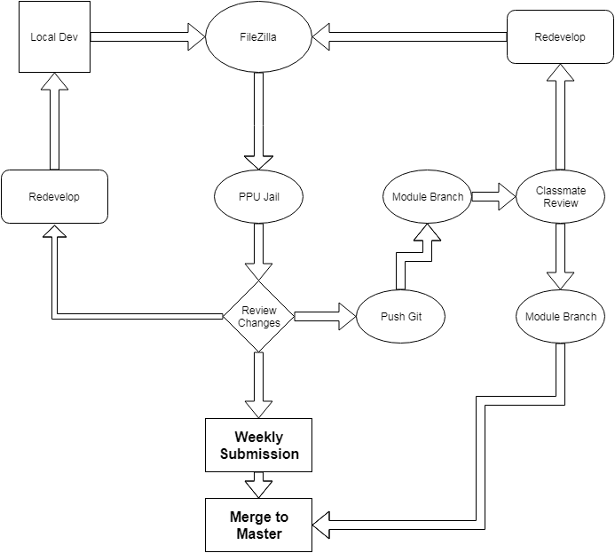

# Personal Website

## What is the purpose:
  The purpose of my e-portfolio is to showcase my interests, a 
  snapshot of me, an image gallery of my work, and my current resume.

## Development Platform:
  This website was originally developed using NotePad++, but due to some 
  limitations was later developed using Atom. The website is hosted on 
  Point Park University's IT webserver in my jail.

## Development Languages:
  HTML, CSS, JQuery, and Node
  
## Environmental Details:

:Personal_App: Personal Website
:App_Location: PPU
:App_Environment: FreeBSD Jail
:App_URL: http://jmoore.it.pointpark.edu
:App_Status: Available
:App_Version: 1.0.5
:App_GitURL: https://github.com/jimmoorepa/CMPS-262
[grid="rows",format="csv"]
|=============================
App,Location,Environment,URL,Status,Version,Git_URL
`{Personal_App}`,`{App_Location}`,`{App_Environment}`,`{App_URL}`,`{App_Status}`,`{App_Version}`,`{App_GitURL}`
|=============================

## Changelog:

[cols="15,25,60",options="header"]
|=====
^|Item | Issue Description | Resolution

a| 
------
Issue #1 | NYT API refine search by date. | Debugging led me to my api.js file where the if statement was built incorrectly looking at a value that was always null. I changed the if statement to !== "" instead of using the keyword null.

a| 
------
Issue #2 | Portfolio images won't expand. | Debugging led me to removing my original button, and replacing with a small javascript function that opens the images in a new window or tab.

a| 
------
Issue #3 | GitHub Branches out of sync. | Merged branches, pulled to my local branch, fixed some files that were automatically updated, added new files to push to master branch.

|=====

## Update Strategy:

[orientation=landscape]
